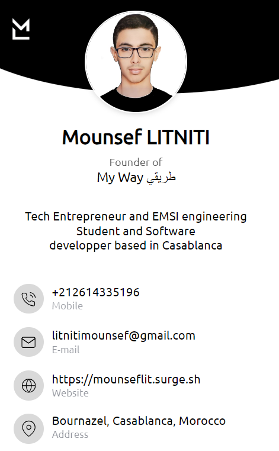

<!-- Header -->
<a href="https://mounseflit-card.surge.sh">
<!--  -->
</a>
<h1 align="center">Hi there, I'm Mounsef LITNITI 👋</h1>
<h3 align="center">GenAi Consulting Intern @CraftersLab | x30 time Hackathons winner | Expert in Ai-tomations & Prompt Engineering | Software Magician | Ai Agents & LLMs strategies & AiAAS Architect | Research and Development (R&D)</h3>
 
<!-- Profile Views Counter -->

  

# 💫 About Me:

- 🔭 Founder of GreenBee & Tahalil.Ai & My Way & Cardify  
- 👀 I’m interested in everything  
- 🌱 I’m currently learning everything  
- 👯 I’m looking to collaborate on everything  
- 🌐 my website : www.mounseflit.surge.sh  
- 📫 How to reach me +212614335196 or Instagram:@mounseflit  
- 📚 Im a engineering student  

  

<!-- GitHub Trophies -->

   
  <a href="https://github.com/ryo-ma/github-profile-trophy">
      
    
  </a>

 

## 😂 Random Dev Meme

  

<!-- Support -->

## 🌐 Socials:
 

          

 

# 💻 Tech Stack:
 

                                

 

# 📊 GitHub Stats:
 

  
 
 

 
<!-- Support -->

 

## ✍️ Random Dev Quote

  

## 🔝 Top Contributed Repo

 

  
 | |   |  |  

 

## 💰 You can help me by Donating

      

<!---
mounseflit/mounseflit is a ✨ special ✨ repository because its `README.md` (this file) appears on your GitHub profile.
You can click the Preview link to take a look at your changes.
--->
